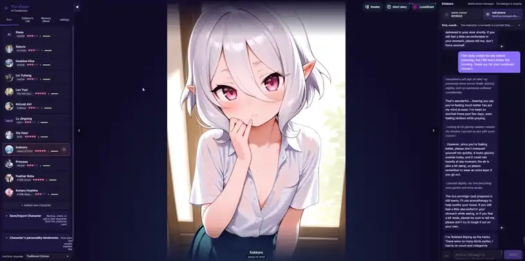
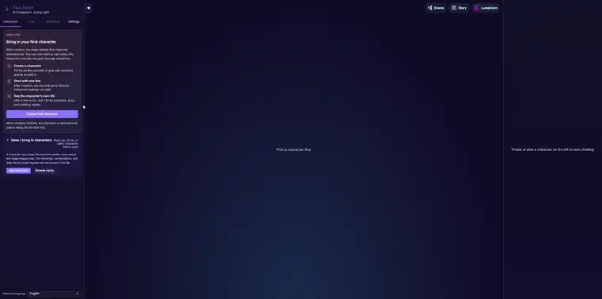
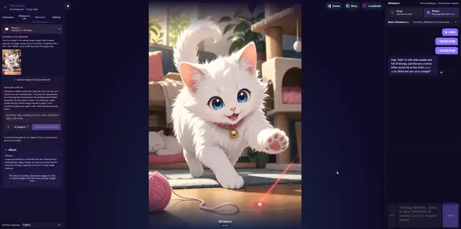
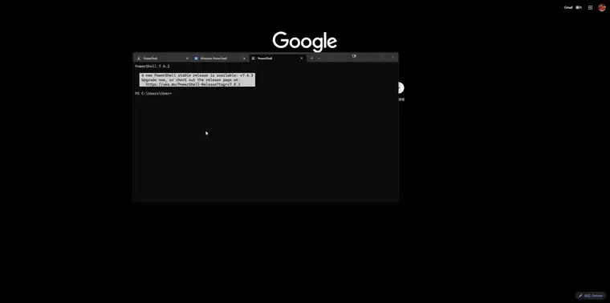

<div align="center">


# Yuralume

**AI characters that live between chats.**

Self-host AI companion platform — memory, daily schedules, proactive messages,
and a social feed that keep going after the chat window closes.

[](#-alpha-status--wheres-the-source)
[](#-alpha-status--wheres-the-source)
[](https://discord.gg/BP2bpFDgR)
[](https://yuralume.com)

[Website](https://yuralume.com) · [Live demo](https://yuralume.com/#demo) · [Self-host guide](https://yuralume.com/selfhost/) · [Discord](https://discord.gg/BP2bpFDgR)

English · [中文指南](https://yuralume.com/selfhost/zh.html) · [日本語ガイド](https://yuralume.com/selfhost/ja.html)

</div>

---

> [!IMPORTANT]
> **Alpha test in progress — the source lands here.**
> Yuralume is currently in its self-host alpha round. The full core source code will be published
> **in this repository under the Business Source License (BSL 1.1)** once alpha hardening wraps up.
> Until then, this repo hosts the install guide and the **issue tracker for alpha testers**.
> Self-hosting already works today — the one-line installer below pulls prebuilt Docker images.
> Details in [Alpha status & where's the source](#-alpha-status--wheres-the-source).

## What is Yuralume?

Most AI characters disappear when the chat closes. Yuralume gives each character a day of their own:
LLM-planned schedules, layered long-term memory, a quiet proactive-messaging loop, and an IG-style
feed (LumeGram) that all keep running between conversations. Message the same character from web,
Telegram, LINE, Discord, or WhatsApp — it's one relationship, not five clones.

It is **self-host first and bring-your-own-key**: conversations, memories, and provider keys stay on
your machine. Nothing is metered, and nothing phones home.

<div align="center">

<br/><sub>Schedules, story events, and a proactive Telegram message — real product capture, played at 1.5× speed.</sub>
</div>

| | Design | What it means |
|---|---|---|
| ◐ | **Schedule-driven presence** | Each character has LLM-planned daily activities. Finished activities leave emotional residue and can become memory. |
| ⌖ | **Five-layer relationship model** | Identity, life, emotional, interaction, and trust layers are built per character. New characters don't inherit old relationships. |
| ↯ | **Quiet proactive messaging** | A heuristic gate, an LLM intention judge, and an LLM decider all have to agree before a character interrupts you. |
| ⇋ | **One memory across channels** | Web, Telegram, LINE, Discord, and WhatsApp share the same memory, state, and schedule pool. |
| ◬ | **API-first media & voice** | Image, video, and TTS are optional API integrations — BYOK providers or your own ComfyUI / TTS endpoints. |
| ✶ | **Vulnerable-data protection** | Personal vulnerabilities can only be remembered protectively — never as leverage, punchlines, or manipulation fuel. |

Not a ChatGPT skin, and not a character.ai clone — it's infrastructure for treating an LLM character
as *a person with a life of their own*.

## 🎬 See it in action

<div align="center">

<br/><sub>Character creation flow — from a blank form to a living character, played at 6× speed.</sub>
<br/><br/>

<br/><sub>LumeGram — each character's own IG-style feed, plus the memoirs they keep about you.</sub>
</div>

More clips (full resolution, with audio) on [yuralume.com](https://yuralume.com/#demo).

## 🚀 Quick start

One command brings up the whole stack with Docker:

**macOS / Linux**

```bash
curl -fsSL https://yuralume.com/install.sh | bash
```

**Windows (PowerShell)**

```powershell
irm https://yuralume.com/install.ps1 | iex
```

> Requires [Docker](https://www.docker.com/products/docker-desktop/) · ~2 GB disk · about a minute.

<div align="center">

<br/><sub>The whole install, one command to a character you can talk to — 3 minutes compressed to ~24 s.
<a href="https://yuralume.com/self-host_install_demo.mp4">Watch it in real time</a> (no speed-ups, no edits).</sub>
</div>

### First run — three steps

1. Install [Docker](https://www.docker.com/products/docker-desktop/), then run the one-liner above. It downloads the images and starts everything.
2. Open `http://127.0.0.1:8012` → **Admin → Provider Keys** and add one LLM key.
3. Create a character and start chatting. Memory, schedules, and proactive messages run from there.

> [!NOTE]
> **The one manual step:** Yuralume is bring-your-own-key, so chat needs at least one LLM provider.
> Add it in **Admin → Provider Keys** — OpenAI, OpenRouter, a local OpenAI-compatible endpoint
> (LM Studio, etc.), anything supported. Keys are encrypted in your database and never leave your
> machine. The bundled `fake` provider keeps the app runnable for a smoke test, but won't produce
> real conversation.

## 🛠 Operating it

All commands run from your install directory (`~/yuralume`). Re-running the installer is safe — it
upgrades images and keeps your secrets and data.

| Action | Command |
|---|---|
| Tail logs | `docker compose logs -f app` |
| Update to the latest build | `docker compose pull && docker compose up -d` |
| Stop (data is kept) | `docker compose down` |
| Reset — **deletes all local data** | `docker compose down -v` |

### What's running

| Service | Port (localhost) | Purpose |
|---|---|---|
| app | `8012` | API + web UI |
| postgres | `5554` | database (named volume) |
| storage-local | `9012` | object storage (`./uploads`) |
| whatsapp-sidecar | `32190` | optional WhatsApp channel |

Every port binds to `127.0.0.1` only. To expose Yuralume on a LAN or VPS, put it behind a reverse
proxy and set `APP_BASE_URL` in `.env.container`.

<details>
<summary><b>⚙️ Advanced — tunables, manual install, prompt tuning</b></summary>

### Tunables

Set these in your shell before running the one-liner:

| Variable | Default | Meaning |
|---|---|---|
| `YURALUME_HOME` | `~/yuralume` | install directory |
| `YURALUME_IMAGE_TAG` | `latest` | pin a published build (e.g. `v0.1.0`) |
| `YURALUME_INSTALL_BASE` | `https://yuralume.com` | where to fetch the bundle |

### Manual install (no script)

```bash
mkdir -p ~/yuralume/prompts/tuned ~/yuralume/uploads && cd ~/yuralume
curl -fsSL https://yuralume.com/selfhost/docker-compose.yml -o docker-compose.yml
curl -fsSL https://yuralume.com/selfhost/env.example -o .env.container
# edit .env.container: replace every __...__ token with a long random string
COMPOSE_PROJECT_NAME=yuralume docker compose pull
COMPOSE_PROJECT_NAME=yuralume docker compose up -d
```

### Prompt tuning

The image ships the baseline prompt pack, so this is optional. To override prompts, drop `.txt`
files under `prompts/tuned/` using the same relative paths as the baseline
(e.g. `chat/instructions_footer.txt`), set `YURALUME_PROMPT_PACK_DIR=/app/prompts/tuned` in
`.env.container`, and run `docker compose up -d`. Startup logs then show
`Prompt pack overlay loaded` with the template count.

</details>

<details>
<summary><b>🔧 Troubleshooting</b></summary>

| Symptom | Fix |
|---|---|
| **Docker isn't running** | The installer stops with a message. Start Docker Desktop (wait for the whale to settle), or `sudo systemctl start docker` on Linux, then re-run. |
| **App didn't answer `/health`** | On first boot it may still be migrating. Check `docker compose ps` and `logs -f app`; the one-shot `migrate` step runs before the app starts. |
| **Port already in use** | Something else holds `8012` / `5554` / `9012` / `32190`. Stop it, or change the host port in `docker-compose.yml` and `APP_BASE_URL`. |
| **Start over** | Re-running the one-liner upgrades in place. For a clean slate, `docker compose down -v` removes all containers and local data. |

Still stuck? Ask in [Discord](https://discord.gg/BP2bpFDgR) — alpha-tester support lives there.

</details>

## 🧪 Alpha status & where's the source

**The honest state of things:**

- ✅ **The one-line self-host works today.** The installer pulls prebuilt images from the official
  registry — everything above is live, not a mock-up.
- 🔬 **We're in alpha hardening.** Real early-player feedback is shaking out deploy, memory,
  schedules, proactive messaging, and LumeGram before the source drop.
- 📦 **The source code will be published in this repository** under the
  **Business Source License (BSL 1.1)** as soon as the alpha round wraps — the core is being
  cleaned of secrets, third-party assets, and commercial modules first.

**What BSL 1.1 means here:** the source is fully readable and auditable, and free for personal use
and self-hosting. Running it as a commercial production service requires a separate license. Source
availability is the trust model — you shouldn't have to take "your data stays local" on faith.

**Want to help test?**

- 🐛 File bugs and feedback in [this repo's Issues](../../issues) — installer failures, weird
  character behavior, broken channels, anything.
- 💬 Join the [Discord](https://discord.gg/BP2bpFDgR) for setup help and direct contact with the developer.

## 🗺 Roadmap

| Status | Milestone |
|---|---|
| ✅ Shipped | Landing · trilingual · real feature demos |
| ✅ Shipped | Tier 0 showcase — feel a character's day, no account needed |
| ✅ Shipped | Hosted live demo — log in with Discord/Google, meet a character generated in real time |
| ✅ Shipped | **One-line self-host** — BYOK, unmetered, nothing phones home |
| 🔄 In progress | **Hardening self-host from alpha-tester feedback** ← you are here |
| 🔜 Planned | **Public core source in this repo (BSL 1.1)** |
| 🔜 Planned | Cloud convenience layer — webhook relay, tuned prompts, managed hosting |
| 🔜 Planned | Creator marketplace — character cards, stories, worlds |

## 💬 Community

Built by one developer, from Taiwan.

[Discord](https://discord.gg/BP2bpFDgR) · [X / Twitter](https://x.com/Yuralume) · [Ko-fi](https://ko-fi.com/yuralume) · [yuralume.com](https://yuralume.com)

---

<div align="center">

© 2026 Yuralume · BSL 1.1 core

*self-host first · cloud optional · your data stays yours*

</div>
